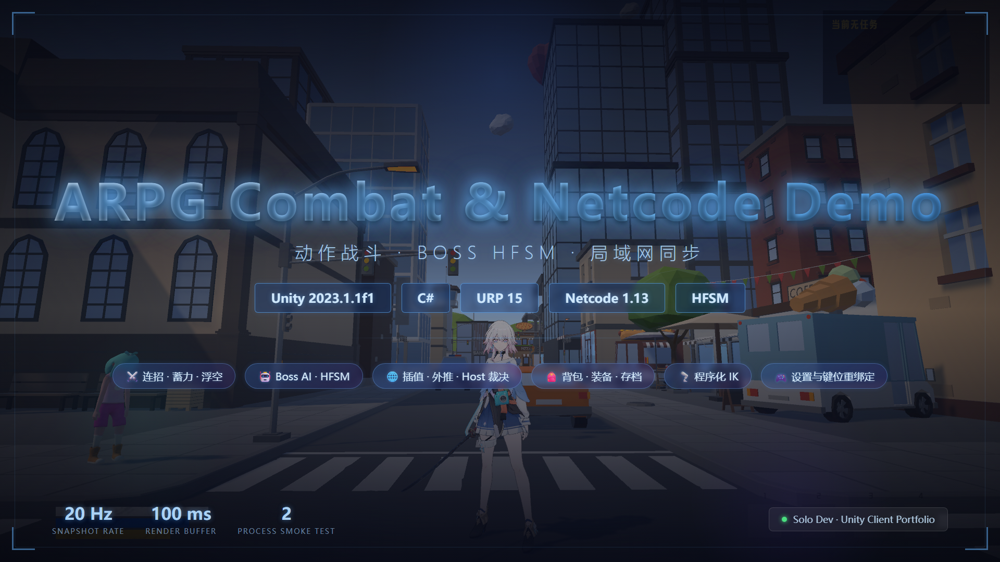
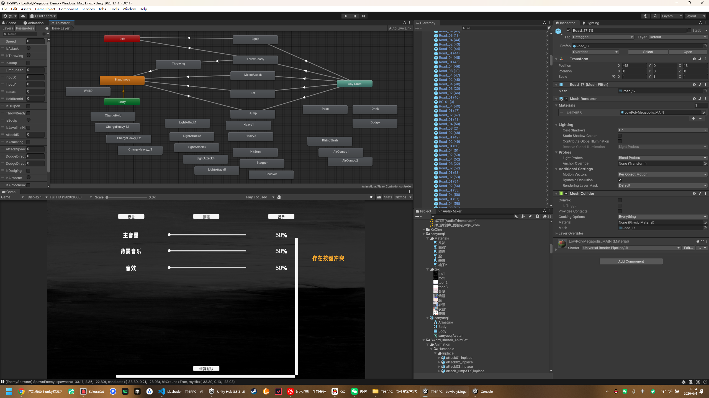
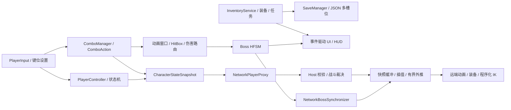

# ARPG Combat & Netcode Demo

[▶ 在 B 站观看完整演示](https://www.bilibili.com/video/BV1SwEy6sEEe/)

> 基于 Unity 2023.1 与 URP 的第三人称动作 RPG Demo，重点展示可扩展连招、Boss HFSM，以及支持局域网双进程验证的状态同步方案。





## 架构概览



完整的模块边界、数据流和设计取舍见 [架构说明](docs/architecture.md)。

## 核心技术点

| 模块 | 实现 | 可验证结果 |
| --- | --- | --- |
| 战斗 | `ComboAction` 动作对象 + 输入缓冲 + 动画归一化时间窗口，支持五段轻击、蓄力分级、上挑、空连、砸地与闪避取消 | 新招式以独立 Action 扩展，命中盒只在攻击窗口开启 |
| Boss AI | `CompositeState` 组成 Alive/Death 顶层状态，Alive 内切换 Observe、Chase、Combo、Block、HitStun、Stagger、Recover 等叶状态 | 当前叶状态可递归查询，事件沿组合状态向下分发 |
| 玩家同步 | 位置、旋转、速度、动画状态、输入参数、动作标志和装备 ID 打包为可序列化快照 | 20Hz 发送；乱序插入、序号去重、最多缓存 32 帧 |
| 平滑策略 | 以网络时钟回看 100ms，在相邻快照间插值；包间隙按速度外推 | 外推上限 120ms；超过 3m 才瞬移纠偏 |
| 权威边界 | 客户端提交移动快照，Host 校验序号与最大位移；Boss AI、生命、死亡复活、攻击请求和伤害由 Host 裁决 | 非法移动和越距/过频攻击请求在 Host 拒绝 |
| 本地系统 | 事件驱动背包、装备/快捷栏、四槽 JSON 存档、任务、音频、显示设置与 Input System 键位覆盖 | 单机数据与联机状态边界明确，背包/存档不参与本 Demo 网络同步 |
| 自动验证 | Development Build 内置 `-sync-smoke` 驱动器，同时检查移动、旋转、动画参数、攻击标志与 Boss 同步 | Host/Client 双进程均 PASS；本次位置误差为 **0.040–0.076m** |

### 双进程同步实测

| 检查项 | 结果 |
| --- | ---: |
| Host 接收 Client | `0.040m`，移动/旋转/跑步参数/攻击标志通过 |
| Client 接收 Host | `0.076m`，移动/旋转/跑步参数/攻击标志通过 |
| Client 接收 Boss | `0.076m`，移动与旋转通过 |
| 进程结论 | `HOST_PASS` / `CLIENT_PASS` |

这些数值是 2026-08-15 本机双进程冒烟测试在成功帧记录的同步误差，不代表网络 RTT 或统计学平均值。测试环境、验收阈值和复现命令见 [验证记录](docs/verification.md)。

## 如何运行

### 环境

- Unity `2023.1.1f1`，请使用相同版本打开，避免场景和 Prefab 被升级重写。
- Windows 10/11；首次导入需要由 Unity Package Manager 解析 `Packages/manifest.json`。
- 主要包：URP `15.0.6`、Input System `1.7.0`、Netcode for GameObjects `1.13.0`、Unity Transport `1.4.0`。

### 单机 Demo

1. 使用 Unity Hub 添加仓库目录。
2. 打开 `Assets/Scenes/00-Mainmeun.unity` 从主菜单开始，或直接打开 `Assets/Scenes/01-GameScene.unity`。
3. 进入 Play Mode。

常用操作：`WASD` 移动、`Space` 跳跃、`Left Shift` 冲刺/闪避、鼠标左键轻击、鼠标右键蓄力重击、`W + 右键` 上挑、`F` 特殊技、鼠标中键锁定、`E` 交互、`Tab` 背包、`1–4` 快捷栏。

### 局域网 Demo

1. 打开 `Assets/Scenes/02-NetworkGameScene.unity`。
2. 使用菜单 `Tools/ARPG/Build Network Demo/Windows Player`，构建产物位于 `Builds/NetworkDemo/`，该目录不会提交到 Git。
3. 启动一端并点击 Host；另一端输入 Host 的局域网 IPv4 地址后点击 Client。同机测试使用 `127.0.0.1`。

也可以直接通过命令行启动：

```text
ARPGNetwork.exe -host
ARPGNetwork.exe -client 192.168.1.10
```

默认使用 UDP `7777` 端口。跨设备测试时需允许 Windows 防火墙放行该端口。

## 代码导航

| 路径 | 内容 |
| --- | --- |
| `Assets/Scripts/CombatV2` | 连招调度、动作对象、输入缓冲与蓄力分级 |
| `Assets/Scripts/Boss` | Boss HFSM、叶状态与动画事件 |
| `Assets/Scripts/Network` | NGO 会话、玩家/Boss 桥接、双进程冒烟测试 |
| `Assets/Scripts/Other/Player` | 移动、状态机、快照插值外推、程序化 IK |
| `Assets/Scripts/Inventory`、`Save`、`Settings` | 背包、持久化与设置系统 |
| `Assets/Editor/NetworkDemoSetup.cs` | 联机场景校验与 Development Player 构建入口 |

## 资源与代码归属

本仓库用于展示作者编写的游戏客户端业务代码与系统设计。角色、场景、动画、音频、字体及部分 Shader/插件属于各自原作者或许可方，不作为原创代码成果声明；详见 [资源说明](ASSET_NOTICE.md)。仓库未附带统一的开源许可证，未经许可请勿复用代码或第三方资源。
