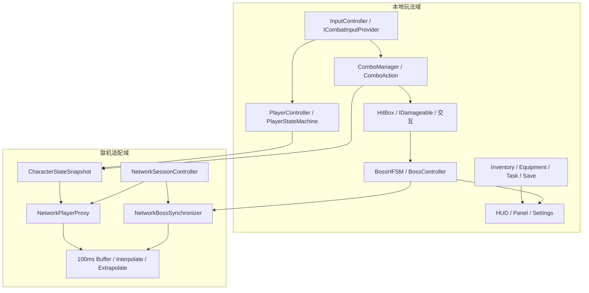
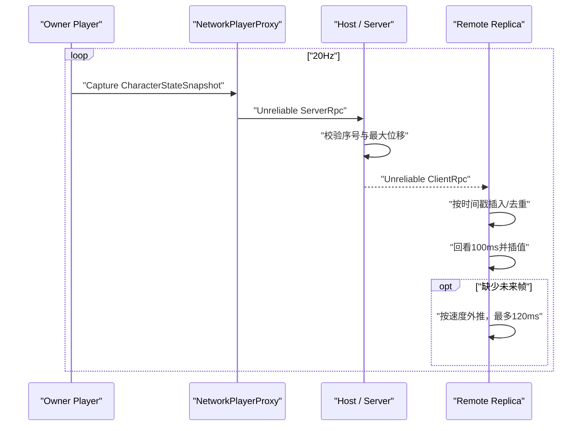

# 架构说明

## 1. 设计目标

项目围绕三个可独立演示的能力组织：动作战斗、Boss 行为与局域网状态同步。核心原则是把“输入与规则”“动画与表现”“传输与平滑”分开，使单机逻辑不直接依赖 Netcode，网络层也不复制整套角色控制器。



## 2. 战斗系统

`ComboManager` 是动作调度器，负责采样输入、维护短时输入缓冲、缓存动作实例并在帧末执行状态切换。每个招式继承 `ComboAction`，自行声明动画、伤害、连段窗口和取消规则：

```text
ICombatInputProvider
        │
        ▼
ComboManager ──复用──> ComboAction
        │                 ├─ LightAttack1 ... LightAttack5
        │                 ├─ ChargeHeavy
        │                 ├─ RisingSlash -> AirCombo -> GroundSlam
        │                 └─ DodgeAction
        ▼
ComboContext -> WeaponBase -> HitBox -> IDamageable
```

`ComboContext` 汇集 Animator、武器、角色控制器和当帧输入，动作不需要自行寻找场景对象。命中盒由动作根据动画归一化时间开启和关闭，避免碰撞器常驻。动作对象缓存在字典中复用，切换过程不持续分配 GC 对象。

## 3. Boss HFSM

Boss 使用组合状态实现两层 HFSM：根节点在 `AliveState` 与 `DeathState` 之间切换；Alive 内再管理 Observe、Chase、Combo、Block、HitStun、Stagger、Recover、Retreat 等叶状态。

`CompositeState.Change` 统一保证旧状态退出、新状态进入；`CurrentLeaf` 递归返回当前叶状态；`OnEvent` 将受击等事件沿当前组合分支下发。Boss 的导航、格挡耐力、连招选择和动画事件仍由 `BossController` 提供上下文，状态只持有行为规则。

## 4. Netcode 数据流



### 快照内容

`CharacterStateSnapshot` 包含序号、网络时间戳、位置、旋转、速度、Animator 状态哈希/归一化时间、移动参数、跳跃速度、装备 ID，以及 Grounded/Jumping/Attacking/Dodging/AirborneAction 位标志。结构实现 `INetworkSerializable`，传输层不需要反射序列化。

### 平滑与纠偏

- Authority 默认 20Hz 产生快照。
- Replica 按时间戳排序插入，拒绝重复序号，缓存上限为 32。
- 渲染时间为当前网络时间减 100ms，以较小延迟换取相邻两帧插值空间。
- 没有未来帧时按最后速度外推，时间上限为 120ms。
- 最终位置/旋转再使用指数阻尼收敛；误差达到 3m 才直接瞬移。
- 远端角色只同步高层动画和装备状态，足部 IK 在接收端重新计算，不传骨骼流。

### 权威边界

这不是“所有移动都由服务器模拟”的纯服务器权威架构。Owner 产生移动快照，Host 使用递增序号、时间间隔、最大速度与容差验证后转发；Boss AI、Boss 状态、玩家生命/复活和攻击伤害由 Host 裁决。该取舍适合双人局域网作品演示，减少了将既有单机控制器改造成预测/回滚控制器的成本。

## 5. 本地数据系统

- `InventoryService` 管理物品堆叠、容量、筛选和排序；UI 通过 `InventoryEvents` 更新。
- 装备、快捷栏和任务进度由各自管理器维护，`SaveManager` 汇总为四槽 JSON 存档。
- `SettingsManager` 将音量/显示配置保存到 PlayerPrefs，将 Input System 覆盖保存到 `KeyConfig/keybindings.json`。
- 背包、任务、存档和设置刻意保持为本地系统，不属于局域网 Demo 的同步范围。

## 6. 目录边界

| 目录 | 责任 |
| --- | --- |
| `Assets/Scripts/CombatV2` | 动作规则与连段调度 |
| `Assets/Scripts/Boss` | Boss HFSM 与状态实现 |
| `Assets/Scripts/Network` | Netcode 会话和玩法适配 |
| `Assets/Scripts/Other/Player` | 角色控制、玩家状态、同步内核与 IK |
| `Assets/Scripts/Inventory` | 背包领域模型与事件 |
| `Assets/Scripts/Save` | 多槽位持久化 |
| `Assets/Scripts/Settings` | 音频、显示、灵敏度与按键设置 |
| `Assets/Scripts/UI`、`HUD` | 界面表现与用户反馈 |

## 7. 已知边界

- 联机房间上限为 2 人，未实现公网大厅、NAT 穿透、断线重连或主机迁移。
- 玩家移动采用 Host 校验转发，不包含客户端预测、服务器回滚或输入重演。
- 冒烟测试验证局域网功能路径与成功帧误差，不替代延迟/抖动/丢包压力测试。
- 美术和音频用于代码作品展示，不属于原创代码成果，公开分发前应逐项复核许可。
